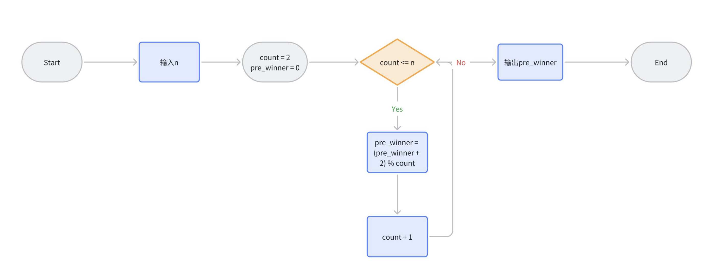
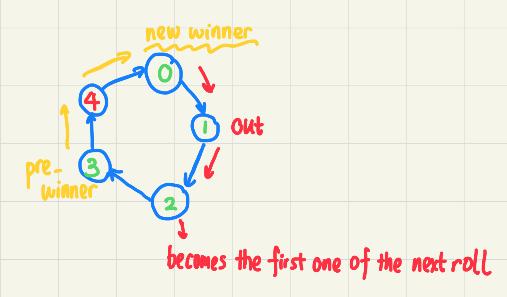
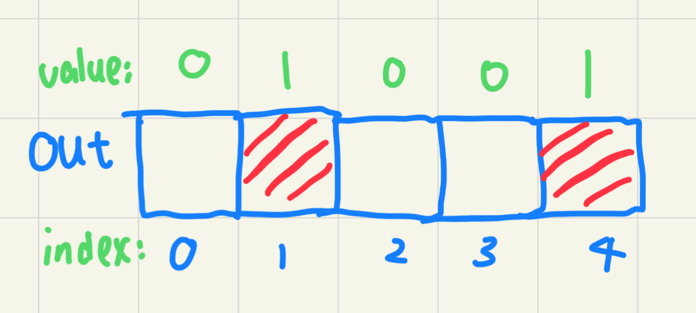
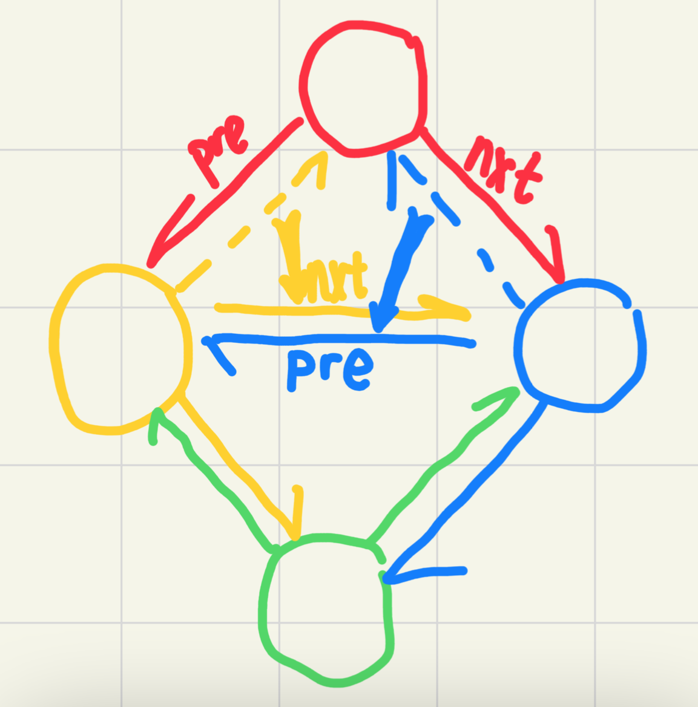

本文件夹可直接编译 `task5.c`，也可以使用 CMake 编译，后者的源码在 `src/` 和 `include/` 目录下，并且按照库源码和运行源码进行了拆分。

`task5.c` 是为 Online Judge 的文本比较评测准备的，因此没有交互文字。使用 CMake 编译得到的可执行文件拥有较好的交互，形如：

```
This program will the answers from 3 different methods.
Input the number of players:
2000
The standard method from pdf gives: 1952
The array method gives: 1952
The list method gives: 1952
```

## pdf 中的解法 `solve_std()`



只剩下一人时，第一个报数的人就是胜者 (`pre_winner`)。流程图用 $k$ 玩家数的胜者反推 $k + 1$ 玩家数的胜者。



设玩家数为 $k$ 人时，胜者为 $p$ 号，则玩家数为 $k + 1$ 人时，胜者为 $(p + 2) \mod (k + 1)$ 号。正确性如下：$k + 1$ 名玩家开始报数时，$1$ 号将出局，$2$ 号成为下一轮的第一个报数者（即 $k$ 人游戏的 $0$ 号），$3$ 号成为下一轮第二个报数者... 依此类推，$k$ 号成为下一轮游戏的第 $(k - 2 + n) \mod n$ 个报数者。因此，$(p + 2) \mod (k + 1)$ 号会成为下一轮（即 $k$ 人游戏）的第 $p$ 号报数者，也就是最后的胜者。

- 时间复杂度：该过程可以用长度为 $n - 1$ 的循环实现，复杂度 $O(n)$。
- 空间复杂度：不需要开额外数组，复杂度 $O(1)$。

```c
int solve_std(int n) {
    // 从剩余人数为 k 时的胜者
    // (剩余人数 1 时为 0 号) 反推剩余人数为 k + 1 时的胜者。
    // count 表示模拟情况的剩余人数。
    int count = 2;
    // pre_winner 表示当前剩余人数情况下的胜者编号，
    // 剩余人数为 1 时，胜者为 0 号，也就是初始值。
    int pre_winner = 0;
    // 当前要求的答案是剩余 count 个人时，从 0 号开始报数的胜者。
    while (count <= n) {
        // 若剩余人数为 k 时胜者为 p 号，
        // 则剩余人数为 k + 1 时的 (p + 2) 号
        // 在一次初始报数后就会成为 p 号，因此他将成为胜者。
        pre_winner = (pre_winner + 2) % count;
        count += 1;
    }
    return pre_winner;
}
```

## 数组解法 `solve_array()`


    
开一个大小为 $n$ 的数组 `out`，其中 `out[i] == 1` 表示 $i$ 号出局。在 `for` 循环中遇到出局者则跳过报数，直到有 $n - 1$ 人出局。

```c
int solve_array(int n, int out[]) {
    // out[i] == 1 表示第 i 个人已经出局
    int pos = 0; // 当前报数者位置
    for (int num = n /*剩余人数*/; num >= 2; num--) {
        do {
            // 第一个报数者是 pos，所以寻找第二个报数者。
            pos = (pos + 1) % n;
            // 这里如果 pos 已经出局就跳过。
        } while (out[pos] == 1);
        out[pos] = 1; // 第二个报数者出局。
        do {
            // 寻找在下一轮第一个报数的人。
            pos = (pos + 1) % n;
        } while (out[pos] == 1);
    }
    // 只剩一个人时，"当前报数者"就是胜者
    return pos;
}
```

- 时间复杂度：每轮报数最多跳过 $n - 1$ 人，共出局 $n - 1$ 人，时间复杂度为 $O(n ^ 2)$。
- 空间复杂度：需要一个大小为 $n$ 的标记数组，复杂度 $O(n)$。

## 双向链表解法 `solve_list()`

使用结点结构体存储每个玩家的前一个和后一个玩家。使用双向链表的原因是方便删除一个玩家。每当遍历到一个出局玩家时，将出局者前一个玩家的 `nxt` 指针指向出局者后一个玩家，对其后一个玩家进行相反的操作。这样删除一个玩家只需要 $O(1)$ 的时间，最后轮到的玩家就是胜者。

下图展示了红色点是如何被删除的。



```c
typedef struct NodeInner Node;
/**
 * @brief 定义了链表的结点，其中两个指针指向前后玩家
 */
struct NodeInner {
    int id; // 玩家序号
    Node* pre; // 前一个玩家
    Node* nxt; // 后一个玩家
};

int solve_list(int n, Node list[]) {
    for (int i = 0; i < n; i++) {
        // for 循环初始化，记录玩家序号，并使所有玩家
        // 首尾相连，构成一个环。
        list[i].id = i;
        list[i].pre = &list[(i - 1 + n) % n];
        list[i].nxt = &list[(i + 1) % n];
    }
    // 从 0 号开始报数
    Node* cur = &list[0];
    for (int num = n; num >= 2; num--) {
        cur = cur->nxt; // 来到第二个报数的玩家
        Node* del = cur; // 该玩家即将出局
        cur = cur->nxt; // cur 指针来到下一回合开始报数的玩家
        del->pre->nxt = del->nxt; // 将被删除玩家的前一个人的 nxt 指针指向被删除者的后一个人
        del->nxt->pre = del->pre; // 将被删除玩家的后一个人的 pre 指针指向被删除者的前一个人
        // 如此一来 del 将从环中删除，不会再被遍历到捏。
    }
    return cur->id;
}
```

- 时间复杂度：每次出局的开销为 $O(1)$，共出局 $n - 1$ 人，时间复杂度为 $O(n)$。
- 空间复杂度：需要一个大小为 $n$ 的链表，复杂度 $O(n)$。
